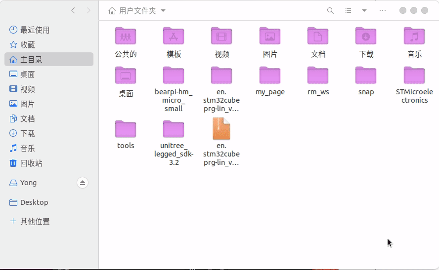
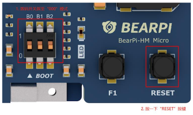

# Linux下配置小熊派-鸿蒙·叔(BearPi-HM Micro)设备开发的开发环境

## 一、前言

原教程考虑到大多数人用Windows系统，而鸿蒙代码的编译又要在Linux系统，所以采用了虚拟机装Linux系统的方案，代码编译完成后却又把固件放在Windows系统用STM32CubeProgrammer进行一个固件的烧录。这样绕来绕去估计好多小伙伴都绕晕了。STM32CubeProgrammer是用JAVA开发的，Windows、Linux、MacOS全平台通用，所以费不着在绕回Windows进行一个烧写固件的操作，直接在Linux下烧录就行了。本着奥卡姆剃刀原理的精神，写下这篇教程。本篇文章适合有Linux基础，装了双系统或者U盘装了Linux系统的小伙伴,以及准备在Linux继续开发小熊派的小伙伴（虚拟机未实测，出了问题自己想办法）。**以Ubuntu 20.04系统为例，从0开始一点点实现安装，编译，烧录全流程。**

## 二、准备工作

1. 一台以及装在实体机上的Linux系统，这里以Ubuntu为例。（不推荐虚拟机，出了问题自己解决）
2. 畅通无阻的网络
3. 小熊派-鸿蒙·叔(BearPi-HM Micro)一台

## 三、流程简介

  修改bash --> 安装依赖 --> 检查Python3.7+ --> 安装hb --> 安装mkimage.stm32 --> 安装STM32CubeProgrammer --> 安装CH340驱动 --> 获取源码 --> 编译烧录

## 四、开始安装

###  1.将Linux shell改为bash

~~~bash
#查看shell是否为bash.
ls -l /bin/sh

#如果为显示为/bin/sh -> bash则为正常，否则请按以下方式修改

#方法一：在终端运行如下命令，然后选择 no。
sudo dpkg-reconfigure dash
#方法二：先删除sh，再创建软链接。
rm -rf /bin/sh
sudo ln -s /bin/bash /bin/sh
~~~

### 2.安装安装必要的库和工具

~~~bash
sudo apt-get install build-essential gcc g++ make zlib* libffi-dev e2fsprogs pkg-config flex bison perl bc openssl libssl-dev libelf-dev libc6-dev-amd64 binutils binutils-dev libdwarf-dev u-boot-tools mtd-utils gcc-arm-linux-gnueabi cpio device-tree-compiler net-tools openssh-server git vim openjdk-11-jre-headless
~~~

### 3.检查Python环境

~~~bash
# 输入如下命令，查看python版本号,确保版本python3.7+
python3 --version

# 如果低于python3.7版本，不建议直接升级，请按照如下步骤重新安装。

# 以python3.8为例，按照以下步骤安装python
sudo apt-get install python3.8
# 设置python和python3软链接为python3.8
sudo update-alternatives --install /usr/bin/python python /usr/bin/python3.8 1
sudo update-alternatives --install /usr/bin/python3 python3 /usr/bin/python3.8 1
# 安装并升级Python包管理工具（pip3）
sudo apt-get install python3-setuptools python3-pip -y
sudo pip3 install --upgrade pip
~~~

### 4.安装hb

~~~bash
# 运行安装命令
python3 -m pip install --user ohos-build
# 配置环境命令(用Ubuntu自带的gedit比较方便，如果是其他Linux发行版的可以使用vi或vim)
gedit ~/.bashrc
# 将以下命令拷贝到.bashrc文件的最后一行，(ctrl+s)保存并退出
export PATH=~/.local/bin:$PATH
# 执行如下命令更新环境变量
source ~/.bashrc
~~~

~~~bash
# 测试是否安装成功
hb -h
# 会看到如下输出

~~~

### 5.安装mkimage.stm32

~~~bash
# 1.新建tools目录
mkdir ~/tools
# 2.下载mkimage.stm32工具，并复制到~/tools目录下(“~”代表的是你的用户目录)
# 3.执行以下命令修改mkimage.stm32工具权限
chmod 777 ~/tools/mkimage.stm32
# 4.设置环境变量
gedit ~/.bashrc
# 将以下命令拷贝到.bashrc文件的最后一行，保存并退出
export PATH=~/tools:$PATH
# 执行如下命令更新环境变量
source ~/.bashrc
~~~

### 6.安装Stm32CubeProgrammer

1. 下载Stm32CubeProgrammer的Linux安装包，[官网链接]()

2. 解压双击.linux文件安装

3. 一路下一步

4. **添加规则文件**（这一步要了我的命，作为最核心的一步，折腾不好差点就放弃了，好在老师救了我）

   + 找到Stm32CubeProgrammer安装目录，安装时可以选择，在用户目录下

     

   ~~~bash
   # 进入Drivers/rules文件夹
   cd Drivers/rules
   # 复制.rules文件到/etc/udev/rules.d
   sudo cp 49-stlinkv2-1.rules 49-stlinkv2.rules 49-stlinkv3.rules 50-usb-conf.rules /etc/udev/rules.d
   ~~~
   
     
   
5. 完成。（添加规则文件这一步十分重要，没有添加在Stm32CubeProgrammer中就检测不到USB了）

### 7.安装CH340驱动

1. 下载CH340的Linux驱动（不要纠结340还是341的问题，能用就行），[官网链接](http://www.wch.cn/download/CH341SER_LINUX_ZIP.html)

2. 解压到任意目录

3. ~~~bash
   # 查看Linux自带的驱动
   ls /lib/modules/$(uname -r)/kernel/drivers/usb/serial
   # 删除原有驱动
   cd /lib/modules/$(uname -r)/kernel/drivers/usb/serial
   sudo rm -rf ch341.ko
   # 查询操作系统的内核版本号
   uname -r
   ~~~

4. 到这个网站寻找对应的代码

5. 打开ch34x.c，替换掉里面的代码

6. ~~~bash
   # 在当前目录打开命令行
   make
   # 复制ch34x.ko文件
   sudo cp ch34x.ko /lib/modules/$(uname -r)/kernel/drivers/usb/serial 
   ~~~

7. ~~~bash
   # 输入lsmod命令查看是否安装成功
   lsmod
   # 存在代表成功
   Module                  Size  Used by
   usbserial              53248  1 ch34x
   ~~~

### 8.获取源码

 在此之前需要先注册gitee账号，并配置邮箱。[源码链接]( https://gitee.com/bearpi/bearpi-hm_micro_small)

~~~bash
git config --global user.name "yourname"
git config --global user.email “your-email-address"
git clone https://gitee.com/bearpi/bearpi-hm_micro_small.git -b master
~~~

### 9.编译安装

~~~bash
# 进入下载路径
cd ~/bearpi-hm_micro_small
# 开始编译
hb set
# 输入当前路径
.
# 回车选择“bearpi-hm_micro”
# 编译
hb build -t notest --tee -f
# 等待直到屏幕出现：build success字样，说明编译成功。
~~~

### 10.复制系统镜像

~~~bash
cp out/bearpi_hm_micro/bearpi_hm_micro/OHOS_Image.stm32 applications/BearPi/BearPi-HM_Micro/tools/download_img/kernel/
cp out/bearpi_hm_micro/bearpi_hm_micro/rootfs_vfat.img applications/BearPi/BearPi-HM_Micro/tools/download_img/kernel/
cp out/bearpi_hm_micro/bearpi_hm_micro/userfs_vfat.img applications/BearPi/BearPi-HM_Micro/tools/download_img/kernel/
~~~

### 11.烧写固件

1. 将开发板的拨码开关上拨到“000”烧录模式，并按一下开发板的RESET按键

2. 点击STM32CubeProgrammer工具的“+”按钮，
   然后选择烧录配置的tsv文件。

   ~~~bash
   # 目录地址
   bearpi-hm_micro_small/applications/BearPi/BearPi-HM_Micro/tools/download_img/flashlayout
   
   ~~~

3. 点击Browse按钮，然后选择工程源码下的烧录镜像路径，选择到download_img即可

   ~~~bash
   # 路径为
   bearpi-hm_micro_small/applications/BearPi/BearPi-HM_Micro/tools/download_img
   ~~~

4. 点击Download按钮启动镜像烧录，并等待烧录完毕

## 五、下载minicom工具连接小熊派终端

~~~bash
# 安装minicom
sudo apt-get install minicom
# 查看串口信息
dmesg | grep ttyUSB
# 修改minicom 配置
sudo minicom -s
~~~

选择serial port setup 回车

 按下键盘A 修改serial Device 的 值为步骤2的串口信息

 按下回车,光标会走到Change which setting?

然后回车,然后选择 Save setup as dfl 回车,回车后选择Exit 回车

~~~bash
# 连接小熊派终端
sudo minicom
~~~

## 六、完毕

