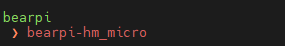
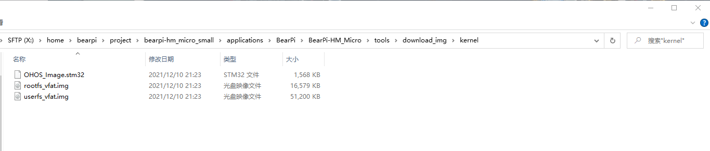

# 如何编译Openharmony系统

1. 在MobaXterm中输入以下指令，进入源码根目录
    ```
    cd /home/bearpi/project/bearpi-hm_micro_small/
    ```
2. 在MobaXterm中输入:
    ```
    hb set 
    ```
    再输入"."(点)
    ``` 
    .
    ```
    选择“bearpi-hm_micro”，然后回车

    

3. 在MobaXterm中输入：
    ```
    hb build -b debug --tee -f
    ```
    然后回车，等待直到屏幕出现：`build success`字样，说明编译成功。

4. 查看编译出的固件位置

    当编译完后，在Windows中可以直接查看到最终编译的固件，具体路径在：
    `\project\bearpi-hm_micro_small\out\bearpi-hm_micro\bearpi-hm_micro`
    其中有以下文件是后面烧录系统需要使用的。
    
    * OHOS_Image.stm32：系统镜像文件
    * rootfs_vfat.img：根文件系统
    * userfs_vfat.img：用户文件系统


    


    *注意，最前的磁盘在为`RaiDrive`映射的路径。
5. 在MobaXterm中执行以下三条指令将以上三个文件复制到`applications/BearPi/BearPi-HM_Micro/tools/download_img/kernel/`下，以便后续烧录系统使用

    ```
    cp out/bearpi_hm_micro/bearpi_hm_micro/OHOS_Image.stm32 applications/BearPi/BearPi-HM_Micro/tools/download_img/kernel/
    cp out/bearpi_hm_micro/bearpi_hm_micro/rootfs_vfat.img applications/BearPi/BearPi-HM_Micro/tools/download_img/kernel/
    cp out/bearpi_hm_micro/bearpi_hm_micro/userfs_vfat.img applications/BearPi/BearPi-HM_Micro/tools/download_img/kernel/
    ```
    
    