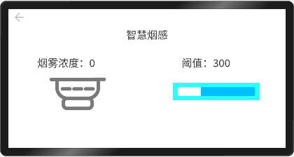

<a id = "文章顶部"></a>

# 智慧烟感E53_SF1扩展板功能使用指导

**说明:**<br>
&emsp;本案例使用E53_SF1(智慧烟感模块)进行开发。目前已经适配好E53接口的底层驱动放在 `device/st/drivers`路径下面,感兴趣的读者可以去翻阅一下。另外，E53模组的底层驱动也已经可以直接调用。用户层可以通过获取驱动发布的服务使用模块。<br>

**下面将讲解E53_SF1的使用教程**

&emsp;[驱动开发](#一e53sf1驱动开发)</br>

&emsp;[JS接口适配](#二js接口层的适配)</br>

&emsp;[烧录运行](#三运行结果)</br>


## 一、E53_SF1驱动开发

1.  确定目录结构。

    在device\st\driver路径下新建E53_SF1文件夹，并创建驱动文件E53_SF1_hdf.c和编译构建文件BUILD.gn
    。
    ```
    .
    └─ device        
        └─ st
            └─ drivers
                └─ e53_driver
                    └─ E53_SF1
                        │─ E53_SF1_hdf.c
                        │─ inc
                        └─ src


    ```

2. E53_SF1驱动实现

    驱动实现包含驱动业务代码和驱动入口注册，在E53_SF1_hdf.c文件中添加以下代码：

    ```C++
    #include <stdint.h>
    #include <string.h>

    #include "E53_SF1.h"
    #include "E53_Common.h"

    #include "hdf_device_desc.h" 
    #include "hdf_log.h"         
    #include "device_resource_if.h"
    #include "osal_io.h"
    #include "osal_mem.h"
    #include "gpio_if.h"
    #include "osal_time.h"


    static uint8_t BeepStatus;
    static float ppm;

    typedef enum {
        E53_SF1_Start = 0,
        E53_SF1_Stop,
        E53_SF1_Read,
        E53_SF1_SetBeep,
    }E53_SF1Ctrl;


    int32_t E53DriverDispatch(struct HdfDeviceIoClient *client, int cmdCode, struct HdfSBuf *data, struct HdfSBuf *reply)
    {
        int ret;
        char *replay_buf;
        HDF_LOGE("E53 driver dispatch");
        if (client == NULL || client->device == NULL) {
            HDF_LOGE("E53 driver device is NULL");
            return HDF_ERR_INVALID_OBJECT;
        }
        switch (cmdCode) {
            case E53_SF1_Start:

                ret = E53_SF1_Init();
                if (ret != 0) {
                    HDF_LOGE("E53 SF1 Init err");
                    return HDF_FAILURE;
                }

                ret = HdfSbufWriteString(reply, "E53 SF1 Init successful");
                if (ret == 0) {
                    HDF_LOGE("replay is fail");
                    return HDF_FAILURE;
                }
                break;
            case E53_SF1_Stop:

                ret = E53_SF1_DeInit();
                if (ret != 0) {
                    HDF_LOGE("E53 SF1 Init err");
                    return HDF_FAILURE;
                }

                ret = HdfSbufWriteString(reply, "E53 SF1 Init successful");
                if (ret == 0) {
                    HDF_LOGE("replay is fail");
                    return HDF_FAILURE;
                }
                break;
            /* 接收到用户态发来的LED_WRITE_READ命令 */
            case E53_SF1_Read:

                ret = GetMQ2PPM(&ppm);
                if (ret != 0) {
                    HDF_LOGE("Get MQ2 ppm failed");
                    return HDF_FAILURE;
                }
                replay_buf = OsalMemAlloc(100);
                (void)memset_s(replay_buf, 100, 0, 100);
                sprintf(replay_buf, "{\"ppm\":%d,\"Beep\":\"%s\"}", (int)ppm, BeepStatus ? "ON" : "OFF");
                ret = HdfSbufWriteString(reply, replay_buf);
                if (ret != true) {
                    HDF_LOGE("replay is fail");
                    return HDF_FAILURE;
                }
                break;
            case E53_SF1_SetBeep:
                const char* read = HdfSbufReadString(data);
                if (strcmp(read, "ON") == 0) {
                    BeepStatus = 1;
                    ret = BeepStatusSet(ON);
                    if (ret != 0) {
                        HDF_LOGE("Beep set status failed!");
                        return HDF_FAILURE;
                    }
                } else if (strcmp(read, "OFF") == 0) {
                    BeepStatus = 0;
                    ret = BeepStatusSet(OFF);
                    if (ret != 0) {
                        HDF_LOGE("Beep set status failed!");
                        return HDF_FAILURE;
                    }
                } else {
                    HDF_LOGE("Wrong command!");
                    return HDF_FAILURE;
                }
                replay_buf = OsalMemAlloc(100);
                (void)memset_s(replay_buf, 100, 0, 100);
                sprintf(replay_buf, "{\"ppm\":%.2f,\"Beep\":\"%s\"}", ppm, BeepStatus ? "ON" : "OFF");
                ret = HdfSbufWriteString(reply, replay_buf);
                if (ret != true) {
                    HDF_LOGE("replay is fail");
                    return HDF_FAILURE;
                }
                break;
            default:
                return HDF_FAILURE;
        }
        return HDF_SUCCESS;
    }


    //驱动对外提供的服务能力，将相关的服务接口绑定到HDF框架
    static int32_t Hdf_E53_SF1_DriverBind(struct HdfDeviceObject *deviceObject)
    {
        if (deviceObject == NULL) {
            HDF_LOGE("e53 driver bind failed!");
            return HDF_ERR_INVALID_OBJECT;
        }
        static struct IDeviceIoService e53Driver = {
            .Dispatch = E53DriverDispatch,
        };
        deviceObject->service = (struct IDeviceIoService *)(&e53Driver);
        HDF_LOGD("E53 driver bind success");
        return HDF_SUCCESS;
    }

    static int32_t Hdf_E53_SF1_DriverInit(struct HdfDeviceObject *device)
    {

        return HDF_SUCCESS;
    }

    // 驱动资源释放的接口
    void Hdf_E53_SF1_DriverRelease(struct HdfDeviceObject *deviceObject)
    {
        if (deviceObject == NULL) {
            HDF_LOGE("Led driver release failed!");
            return;
        }
        HDF_LOGD("Led driver release success");
        return;
    }


    // 定义驱动入口的对象，必须为HdfDriverEntry（在hdf_device_desc.h中定义）类型的全局变量
    struct HdfDriverEntry g_E53_SF1DriverEntry = {
        .moduleVersion = 1,
        .moduleName = "HDF_E53_SF1",
        .Bind = Hdf_E53_SF1_DriverBind,
        .Init = Hdf_E53_SF1_DriverInit,
        .Release = Hdf_E53_SF1_DriverRelease,
    };

    // 调用HDF_INIT将驱动入口注册到HDF框架中
    HDF_INIT(g_E53_SF1DriverEntry);
    ```


4. 驱动编译

    在driver/BUILD.gn文件中添加以下代码，将E53_SF1_hdf.c编译成hdf_E53_adapter。
    添加的部分在 ##start## 和 ##end##* 之间，（"##start##"和"##end##"仅用来标识位置，添加完配置后删除这两行）

    ```C++
    import("//drivers/adapter/khdf/liteos/hdf.gni")
    hdf_driver("hdf_E53_adapter") {
    sources = [
        "E53_IA1/src/E53_IA1.c",
        ##start##
        "E53_SF1/src/E53_SF1.c",
        ##end##
        "E53_SC1/src/E53_SC1.c",
        "E53_SC2/src/E53_SC2.c",
        "E53_IS1/src/E53_IS1.c",

        "E53_IA1/E53_IA1_hdf.c",
        ##start##
        "E53_SF1/E53_SF1_hdf.c", 
        ##end##
        "E53_SC1/E53_SC1_hdf.c",
        "E53_SC2/E53_SC2_hdf.c",
        "E53_IS1/E53_IS1_hdf.c",
    ]
    sources += [
        
    ]

    include_dirs = [
        "adapter/inc/",
        "E53_Common/inc/",

        ##start##
        "E53_SF1/inc/",
        ##end##
    ]

    deps = [
        "E53_Common:E53_Common",
    ]
    }
    ```

5. 驱动配置

    驱动设备描述

    HDF框架加载驱动所需要的信息来源于HDF框架定义的驱动设备描述，因此基于HDF框架开发的驱动必须要在HDF框架定义的device_info.hcs配置文件中添加对应的设备描述，所以我们需要在device\st\bearpi_hm_micro\liteos_a\hdf_config\device_info\device_info.hcs中添加E53_SF1设备描述。 "##start##"和"##end##"之间为新增配置（"##start##"和"##end##"仅用来标识位置，添加完配置后删除这两行）

    ```C++
    device_adc :: device {
        device0 :: deviceNode {
            policy = 0;
            priority = 50;
            permission = 0644;
            moduleName = "HDF_PLATFORM_ADC_MANAGER";
            serviceName = "HDF_PLATFORM_ADC_MANAGER";
        }
        device1 :: deviceNode {
            policy = 0;
            priority = 55;
            permission = 0644;
            moduleName = "stm32mp157_adc_driver";
            deviceMatchAttr = "st_stm32mp157_adc";
        }
    }
    ##start##
    device_e53 :: device {  

            priority = 30;                
            device_sf1 :: deviceNode {             
                policy = 2;                     
                priority = 130; 
                preload = 1;                               
                permission = 0777;              
                moduleName = "HDF_E53_SF1";        
                serviceName = "hdf_e53_sf1 ";    
            }
    }
    ##end##
    ```

## 二、JS接口层的适配

1. 添加控制E53_SF1的JS API接口

    修改`foundation\ace\ace_engine_lite\frameworks\src\core\modules\app_module.h`，加入E53IA1Service JS API,（"##start##"和"##end##"仅用来标识位置，添加完配置后删除这两行）

    ```
    public:
    ACE_DISALLOW_COPY_AND_MOVE(AppModule);
    AppModule() = default;
    ~AppModule() = default;
    static JSIValue GetInfo(const JSIValue thisVal, const JSIValue *args, uint8_t argsNum);
    static JSIValue Terminate(const JSIValue thisVal, const JSIValue *args, uint8_t argsNum);
    ##start##
    static JSIValue E53SF1Service(const JSIValue thisVal, const JSIValue* args, uint8_t argsNum);
    ##end##
    #ifdef FEATURE_SCREEN_ON_VISIBLE
        static JSIValue ScreenOnVisible(const JSIValue thisVal, const JSIValue *args, uint8_t argsNum);
    #endif
    ```

    ```
    void InitAppModule(JSIValue exports)
    {
        JSI::SetModuleAPI(exports, "getInfo", AppModule::GetInfo);
        JSI::SetModuleAPI(exports, "terminate", AppModule::Terminate);
    ##start##
        JSI::SetModuleAPI(exports, "e53sf1service", AppModule::E53SF1Service);
    ##end##
    #ifdef FEATURE_SCREEN_ON_VISIBLE
        JSI::SetModuleAPI(exports, "screenOnVisible", AppModule::ScreenOnVisible);
    #endif
    }
    ```

2. 编写控制E53_SF1的c++ 业务代码

    在`foundation\ace\ace_engine_lite\frameworks\src\core\modules\app_module.cpp`中加入控制E53_SF1的c++ 业务代码（"##start##"和"##end##"仅用来标识位置，添加完配置后删除这两行）。

    ```
    #include "app_module.h"
    #include "ace_log.h"
    #include "js_app_context.h"
    #ifdef FEATURE_SCREEN_ON_VISIBLE
    #include "js_async_work.h"
    #include "product_adapter.h"
    #endif

    ##start##
    #include "hdf_sbuf.h"
    #include "hdf_io_service_if.h"

    #define E53_SF1_SERVICE "hdf_e53_sf1"
    ##end##

    namespace OHOS {
    namespace ACELite {
    const char * const AppModule::FILE_MANIFEST = "manifest.json";
    const char * const AppModule::KEY_APP_NAME = "appName";
    const char * const AppModule::KEY_VERSION_NAME = "versionName";
    const char * const AppModule::KEY_VERSION_CODE = "versionCode";

    ```

    ```
    struct AsyncParams : public MemoryHeap {
        ACE_DISALLOW_COPY_AND_MOVE(AsyncParams);
        AsyncParams() : result(nullptr), callback(nullptr), context(nullptr) {}

        JSIValue result;
        JSIValue callback;
        JSIValue context;
    };
    #endif

    ##start##

    static int E53SF1Control(struct HdfIoService *serv, int32_t cmd, const char* buf, char **val)
    {
        int ret = HDF_FAILURE;
        struct HdfSBuf *data = HdfSBufObtainDefaultSize();
        struct HdfSBuf *reply = HdfSBufObtainDefaultSize();

        if (data == NULL || reply == NULL) {
            HILOG_ERROR(HILOG_MODULE_ACE,"fail to obtain sbuf data\n");
            return ret;
        }

        if (!HdfSbufWriteString(data, buf))
        {
            HILOG_ERROR(HILOG_MODULE_ACE,"fail to write sbuf\n");
            HdfSBufRecycle(data);
            HdfSBufRecycle(reply);
            return ret;
        }

        ret = serv->dispatcher->Dispatch(&serv->object, cmd, data, reply);
        if (ret != HDF_SUCCESS)
        {
            HILOG_ERROR(HILOG_MODULE_ACE,"fail to send service call\n");
            HdfSBufRecycle(data);
            HdfSBufRecycle(reply);
            return ret;
        }
    
        *val = (char *)(HdfSbufReadString(reply));
        if(val ==NULL){
            HILOG_ERROR(HILOG_MODULE_ACE,"fail to get service call reply\n");
            ret = HDF_ERR_INVALID_OBJECT;
            HdfSBufRecycle(data);
            HdfSBufRecycle(reply);
            return ret;

        }

        HILOG_ERROR(HILOG_MODULE_ACE,"Get reply is: %s\n", *val);

        HdfSBufRecycle(data);
        HdfSBufRecycle(reply);
        return ret;
    }

    JSIValue AppModule::E53SF1Service(const JSIValue thisVal, const JSIValue *args, uint8_t argsNum)
    {
        struct HdfIoService *serv = HdfIoServiceBind(E53_SF1_SERVICE);
        if (serv == NULL)
        {
            HILOG_ERROR(HILOG_MODULE_ACE,"fail to get service %s\n", E53_SF1_SERVICE);
            return JSI::CreateUndefined();
        }

        if ((args == nullptr) || (argsNum == 0) || (JSI::ValueIsUndefined(args[0]))) {
            return JSI::CreateUndefined();
        }

        JSIValue success = JSI::GetNamedProperty(args[0], CB_SUCCESS);
        JSIValue fail = JSI::GetNamedProperty(args[0], CB_FAIL);
        JSIValue complete = JSI::GetNamedProperty(args[0], CB_COMPLETE);

        int32_t cmd = (int32_t)JSI::GetNumberProperty(args[0], "cmd");  
        char *data = (char *)JSI::GetStringProperty(args[0], "data");
        HILOG_ERROR(HILOG_MODULE_ACE, "cmd is: %d\n", cmd);
        HILOG_ERROR(HILOG_MODULE_ACE,"data is: %s\n", data);
        char *replyData;

        if (E53SF1Control(serv, cmd, data, &replyData))
        {
            HILOG_ERROR(HILOG_MODULE_ACE,"fail to send event\n");
            JSI::CallFunction(fail, thisVal, nullptr, 0);
            JSI::CallFunction(complete, thisVal, nullptr, 0);
            JSI::ReleaseValueList(success, fail, complete);
            return JSI::CreateUndefined();
        }

        JSIValue result = JSI::CreateObject();

        JSI::SetStringProperty(result, "e53_sf1", replyData);
        JSIValue argv[ARGC_ONE] = {result};
        JSI::CallFunction(success, thisVal, argv, ARGC_ONE);
        JSI::CallFunction(complete, thisVal, nullptr, 0);
        JSI::ReleaseValueList(success, fail, complete, result);

        HdfIoServiceRecycle(serv);

        return JSI::CreateUndefined();
    }

    ##end##

    JSIValue AppModule::GetInfo(const JSIValue thisVal, const JSIValue *args, uint8_t argsNum)
    {
        JSIValue result = JSI::CreateUndefined();

        cJSON *manifest = ReadManifest();
        if (manifest == nullptr) {
            HILOG_ERROR(HILOG_MODULE_ACE, "Fail to get the content of manifest.");
            return result;
        }

        cJSON *appName = cJSON_GetObjectItem(manifest, KEY_APP_NAME);
        cJSON *versionName = cJSON_GetObjectItem(manifest, KEY_VERSION_NAME);
        cJSON *versionCode = cJSON_GetObjectItem(manifest, KEY_VERSION_CODE);

        result = JSI::CreateObject();
        if (appName != nullptr && appName->type == cJSON_String) {
            JSI::SetStringProperty(result, KEY_APP_NAME, appName->valuestring);
        }
        if (versionName != nullptr && versionName->type == cJSON_String) {
            JSI::SetStringProperty(result, KEY_VERSION_NAME, versionName->valuestring);
        }
        if (versionCode != nullptr && versionCode->type == cJSON_Number) {
            JSI::SetNumberProperty(result, KEY_VERSION_CODE, versionCode->valuedouble);
        }
        cJSON_Delete(manifest);
        manifest = nullptr;
        return result;
    }
    ```

3. 配置HDF头文件路径

    在`foundation\ace\ace_engine_lite\ace_lite.gni`中添加HDF头文件路径。

    ```
    ace_lite_include_dirs += [
        "//drivers/framework/ability/sbuf/include",
        "//drivers/framework/include/core",
        "//drivers/framework/include/utils",
        "//drivers/adapter/uhdf/posix/include",
    ]
    ```
4. 添加编译依赖

    修改`foundation\ace\ace_engine_lite\frameworks\BUILD.gn`，在`public_deps`中添加以下代码

    ```
    "//drivers/adapter/uhdf/manager:hdf_core",
    ```

    修改`foundation\ace\ace_engine_lite\test\ace_test_config.gni`，在`extra_deps`中添加以下代码
    ```
    "//drivers/adapter/uhdf/manager:hdf_core",
    ```


## 三、运行结果
1. **烧录：**</br>

    参考[编译烧录](BearPi-HM_Micro开发板编译调试.md)

2. **安装Hap应用：**</br>
    参考[安装HAP应用](如何在开发板上安装HAP应用.md)教程安装applications/BearPi/BearPi-HM_Micro/tools/hap_tools/hap_example目录下的Micro_E53.hap应用进行测试

3. **运行结果**</br>
    点击屏幕图标可以对E53_SF1进行控制。
<div align = center></div>
    

&emsp;[回到文章顶部](#文章顶部)

<a id = "文章底部"></a>
