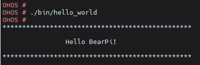
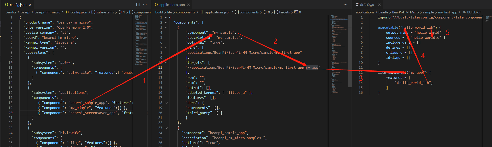

# 编写一个hello_world应用

本示例将演示如何在开发板上运行第一个应用程序，输出“Hello World”。

## 编写源码

1.  确定目录结构。

    开发者编写业务时，务必先在./applications/BearPi/BearPi-HM_Micro/samples路径下新建一个目录（或一套目录结构），用于存放业务源码文件。

    例如：在app下新增业务my\_first\_app，其中hello\_world.c为业务代码，BUILD.gn为编译脚本，具体规划目录结构如下：

    ```
    .
    └── applications        
        └── BearPi
            └── BearPi-HM_Micro
                └── samples
                    │── my_first_app
                       │── hello_world.c
                       └── BUILD.gn

    ```

2.  编写业务代码。

    在hello\_world.c中编写业务代码。

    ```
    #include <stdio.h>
    
    int main(int argc, char **argv)
    {
        printf("\n************************************************\n");
        printf("\n\t\tHello BearPi!\n");
        printf("\n************************************************\n\n");
        
        return 0;
    }
    ```

3.  编写将构建业务代码的BUILD.gn文件。

    如步骤1所述，BUILD.gn文件由三部分内容（目标、源文件、头文件路径）构成，需由开发者完成填写。以my\_first\_app为例，需要创建./applications/BearPi/BearPi-HM_Micro/samples/my\_first\_app/BUILD.gn，并完如下配置。

    ```
    import("//build/lite/config/component/lite_component.gni")

    executable("hello_world_lib") {
        output_name = "hello_world"
        sources = [ "hello_world.c" ]
        include_dirs = []
        defines = []
        cflags_c = []
        ldflags = []
    }

    lite_component("my_first_app") {
        features = [
            ":hello_world_lib",
        ]
    }
    ```

    -   首先导入 gni 组件，将源码hello_world.c编译成hello_world_lib库文件
    -   然后将hello_world_lib打包成 lite_component，命名为my_first_app组件。

    -   输出的可执行文件名称由output_name定义为hello_world

4. 添加新组件

    修改文件build/lite/components/applications.json，添加组件my_sample的配置，如下所示为applications.json文件片段，"##start##"和"##end##"之间为新增配置（"##start##"和"##end##"仅用来标识位置，添加完配置后删除这两行）：

    ```
    {
    "components": [
        ##start##
        {
            "component": "my_sample",
            "description": "my samples",
            "optional": "true",
            "dirs": [
            "applications/BearPi/BearPi-HM_Micro/samples/my_first_app"
            ],
            "targets": [
            "//applications/BearPi/BearPi-HM_Micro/samples/my_first_app:hello_world"
            ],
            "rom": "",
            "ram": "",
            "output": [],
            "adapted_kernel": [ "liteos_a" ],
            "features": [],
            "deps": {
            "components": [],
            "third_party": [ ]
            }
        },
        ##end##
        {
        "component": "bearpi_sample_app",
        "description": "bearpi_hm_micro samples.",
        "optional": "true",
        "dirs": [
            "applications/BearPi/BearPi-HM_Micro/samples/launcher",
            "applications/BearPi/BearPi-HM_Micro/samples/setting"
        ],
        "targets": [
            "//applications/BearPi/BearPi-HM_Micro/samples/launcher:launcher_hap",
            "//applications/BearPi/BearPi-HM_Micro/samples/setting:setting_hap"
        ],
        "rom": "",
        "ram": "",
        "output": [
            "launcher.so",
            "setting.so"
        ],
        "adapted_kernel": [ "liteos_a","linux" ],
        "features": [],
        "deps": {
            "third_party": [
            "bounds_checking_function",
            "wpa_supplicant"
            ],
            "kernel_special": {},
            "board_special": {},
            "components": [
            "aafwk_lite",
            "appexecfwk_lite",
            "surface",
            "ui",
            "graphic_utils",
            "kv_store",
            "syspara_lite",
            "permission",
            "ipc_lite",
            "samgr_lite",
            "utils_base"
            ]
        }
        },
    ```
5. 修改单板配置文件

    修改文件vendor/bearpi/bearpi_hm_micro/config.json，新增my_sample组件的条目，如下所示代码片段为applications子系统配置，"##start##"和"##end##"之间为新增条目（"##start##"和"##end##"仅用来标识位置，添加完配置后删除这两行）：

    ```
    {
    "subsystem": "applications",
        "components": [
          { "component": "bearpi_sample_app", "features":[] },
        ##start##
          { "component": "my_sample", "features":[] },
        ##end##
          { "component": "bearpi_screensaver_app", "features":[] }
        ]
      },
    ```


## 运行结果<a name="section18115713118"></a>

示例代码[编译](如何编译系统.md)、[烧录](如何烧录固件并启动.md)后，在命令行输入指令“./bin/hello_world”执行写入的demo程序，会显示如下结果：





## 总结<a name="section9712145420182"></a>

一个.c文件想要编译进系统可以总结为以下流程：



1. 在config.json中添加"my_sample"组件，"my_sample"组件在applications.json中被定义。
2. 在my_sample的targets里面添加"my_app"的lite_component名称
3. "my_app"字段链接到my_first_app文件下BUILD.gn里面的lite_component。
4. lite_component里指定lib库为"hello_world_lib"。
5. 通过hello_world_lib里面sources来指定要编译的.c文件，并通过output_name来指定生成的可执行程序名称。


在此希望开发者能仔细琢磨并掌握整个流程，有利于学习Openharmomy的编译框架，以及为后续自主开发应用打下基础
